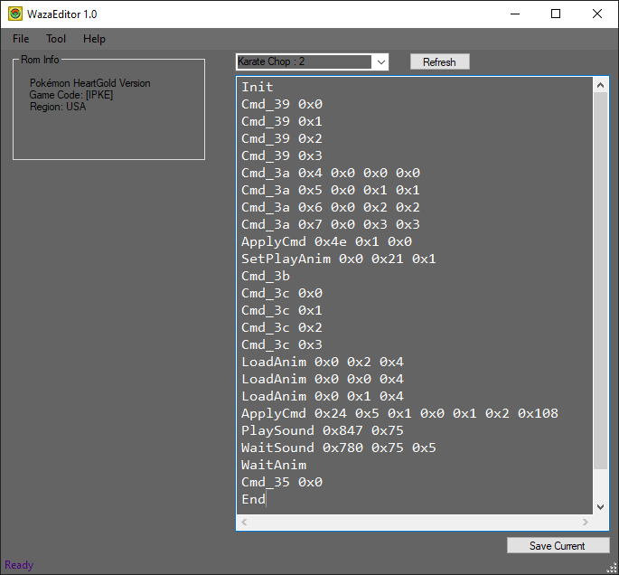

# Waza-Editor
A move effect editor for the generation 4 Pokemon games. Originally developed by Acent (all rights reserved), now with several added features like:

1. Support for HGSS roms (External RomDatabase XML file for user-specific rom details).
2. Soon to include Animation Database Library to view all in-game animations in real-time (downloads from Bulbapedia).
3. Deals directly with rom files instead of extracted DSPRE/SDMSE folders.

Credits also to @murrple-1 for APNG viewer for displaying animated PNGs in winforms.

**DISCLAIMER** This is project is still a work in progress, full functionality is not guaranteed! (gitignore will also be configured later)

## Installation
Build using Visual Studio, requires version 2019 (HTML Agility Pack NuGet required)

Releases will be supplied in later releases.

If any problems should arise feel free to send a dm on discord @DavveDP#6813